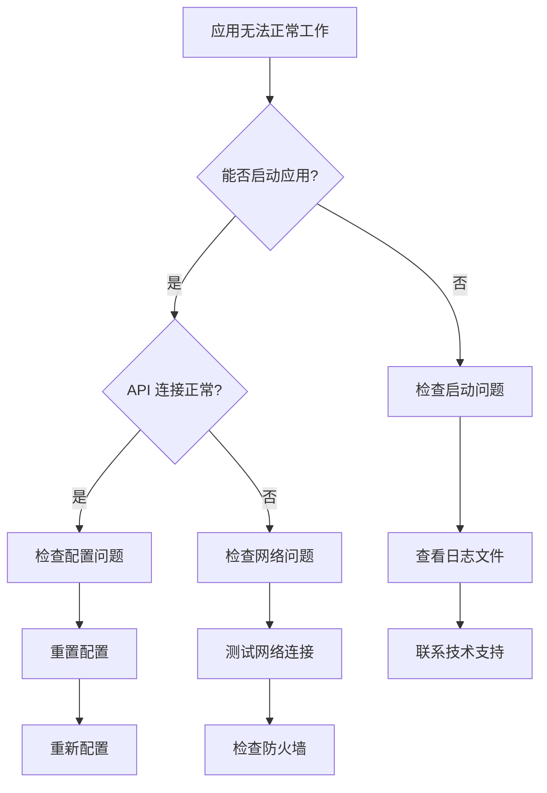

# AI Manager 故障排除指南

## 目录

1. [快速诊断](#快速诊断)
2. [启动问题](#启动问题)
3. [配置问题](#配置问题)
4. [网络连接问题](#网络连接问题)
5. [性能问题](#性能问题)
6. [数据问题](#数据问题)
7. [平台特定问题](#平台特定问题)
8. [高级诊断](#高级诊断)

## 快速诊断

### 自检清单

在联系技术支持之前，请检查以下项目：

- [ ] 系统是否满足最低要求？
- [ ] 安装包是否完整且未损坏？
- [ ] 网络连接是否正常？
- [ ] 防火墙/杀毒软件是否允许应用运行？
- [ ] 是否有足够的磁盘空间？
- [ ] API 密钥是否有效？

### 基本故障排除流程



## 启动问题

### 应用无法启动

#### Windows

**症状**: 双击图标无反应，或出现错误对话框

**可能原因及解决方案**:

1. **缺少运行时库**
   ```cmd
   # 安装 Microsoft Visual C++ Redistributable
   # 下载地址: https://aka.ms/vs/17/release/vc_redist.x64.exe
   ```

2. **权限不足**
   - 右键应用图标
   - 选择"以管理员身份运行"

3. **杀毒软件拦截**
   - 将应用添加到杀毒软件白名单
   - 临时关闭实时保护测试

4. **系统文件损坏**
   ```cmd
   # 运行系统文件检查器
   sfc /scannow
   ```

#### macOS

**症状**: 应用图标跳动后消失，或提示"已损坏"

**解决方案**:

1. **Gatekeeper 限制**
   ```bash
   # 移除隔离属性
   sudo xattr -r -d com.apple.quarantine /Applications/AI-Manager.app
   ```

2. **权限修复**
   ```bash
   # 修复应用权限
   sudo chmod -R 755 /Applications/AI-Manager.app
   ```

3. **检查系统完整性**
   ```bash
   # 重置系统完整性保护（谨慎操作）
   csrutil disable
   # 重启后测试
   csrutil enable
   ```

#### Linux

**症状**: AppImage 无法执行，或出现共享库错误

**解决方案**:

1. **FUSE 问题**
   ```bash
   # Ubuntu/Debian
   sudo apt-get install libfuse2

   # Fedora
   sudo dnf install fuse2
   ```

2. **共享库缺失**
   ```bash
   # 查看缺失的库
   ldd AI-Manager_0.1.0_amd64.AppImage

   # 使用 --no-sandbox 参数
   ./AI-Manager_0.1.0_amd64.AppImage --no-sandbox
   ```

3. **权限问题**
   ```bash
   chmod +x AI-Manager_0.1.0_amd64.AppImage
   ```

### 启动缓慢

**诊断步骤**:

1. **检查系统资源**
   ```bash
   # Windows
   tasklist /fi "imagename eq AI-Manager.exe"

   # macOS/Linux
   ps aux | grep ai-manager
   ```

2. **检查磁盘 I/O**
   - 检查磁盘空间是否充足
   - 运行磁盘碎片整理（Windows）
   - 检查是否有磁盘错误

3. **清理缓存**
   - 删除临时文件
   - 清理应用缓存
   - 重启系统

## 配置问题

### 配置文件损坏

**症状**: 应用启动但显示错误配置，或功能异常

**解决方案**:

1. **备份现有配置**
   ```bash
   # Windows
   copy "%APPDATA%\ai-manager\settings.json" "%APPDATA%\ai-manager\settings.json.backup"

   # macOS/Linux
   cp ~/.config/ai-manager/settings.json ~/.config/ai-manager/settings.json.backup
   ```

2. **重置为默认配置**
   - 删除配置文件，应用会重新创建默认配置
   - 手动编辑配置文件，修复语法错误

3. **从备份恢复**
   ```bash
   # 恢复最近的备份
   cp settings.json.backup settings.json
   ```

### 供应商配置问题

**Claude 供应商连接失败**:

1. **验证 API 密钥**
   - 检查密钥格式是否正确
   - 确认密钥未过期
   - 验证账户余额充足

2. **检查端点 URL**
   ```
   正确: https://api.anthropic.com
   常见错误:
   - http://api.anthropic.com (应为 https)
   - https://api.anthropic.com/ (不应有尾部斜杠)
   ```

3. **测试连接**
   ```bash
   # 使用 curl 测试
   curl -X POST https://api.anthropic.com/v1/messages \
     -H "Content-Type: application/json" \
     -H "Authorization: Bearer YOUR_API_KEY" \
     -H "anthropic-version: 2023-06-01" \
     -d '{"model": "claude-3-haiku-20240307", "max_tokens": 10, "messages": [{"role": "user", "content": "Hi"}]}'
   ```

### 数据库问题

**症状**: 数据加载失败，或数据丢失

**解决方案**:

1. **检查数据库文件**
   ```bash
   # 检查文件是否存在且可读
   ls -la ai_manager.db

   # 检查数据库完整性
   sqlite3 ai_manager.db "PRAGMA integrity_check;"
   ```

2. **修复数据库**
   ```bash
   # 备份损坏的数据库
   cp ai_manager.db ai_manager.db.corrupted

   # 尝试修复
   sqlite3 ai_manager.db ".recover" | sqlite3 ai_manager_recovered.db

   # 如果修复成功，替换原文件
   mv ai_manager_recovered.db ai_manager.db
   ```

3. **重新初始化数据库**
   ```bash
   # 删除数据库文件（会丢失所有数据）
   rm ai_manager.db

   # 重启应用，会自动创建新数据库
   ```

## 网络连接问题

### 防火墙配置

**Windows**:
1. 打开"Windows Defender 防火墙"
2. 点击"允许应用或功能通过 Windows Defender 防火墙"
3. 找到 AI Manager 并勾选"专用"和"公用"网络

**macOS**:
1. 打开"系统偏好设置" > "安全性与隐私" > "防火墙"
2. 点击"防火墙选项"
3. 添加 AI Manager 并设置为"允许传入连接"

**Linux**:
```bash
# Ubuntu (UFW)
sudo ufw allow out to any port 443
sudo ufw allow out to any port 80

# CentOS/RHEL (firewalld)
sudo firewall-cmd --permanent --add-service=https
sudo firewall-cmd --permanent --add-service=http
sudo firewall-cmd --reload
```

### 代理配置

如果使用代理服务器，请正确配置：

1. **环境变量**
   ```bash
   export HTTP_PROXY=http://proxy.company.com:8080
   export HTTPS_PROXY=http://proxy.company.com:8080
   export NO_PROXY=localhost,127.0.0.1
   ```

2. **应用内配置**
   - 打开"通用配置"
   - 找到"网络代理"选项
   - 输入代理服务器地址和端口

### SSL/TLS 问题

**症状**: HTTPS 连接失败，证书验证错误

**解决方案**:

1. **更新系统证书**
   ```bash
   # Ubuntu/Debian
   sudo apt-get update && sudo apt-get install -y ca-certificates

   # macOS
   sudo softwareupdate --install-rosetta --agree-to-license

   # Windows
   # 运行 Windows Update
   ```

2. **禁用证书验证（仅用于测试）**
   在配置中设置环境变量：
   ```
   NODE_TLS_REJECT_UNAUTHORIZED=0
   ```

## 性能问题

### 内存占用过高

**诊断**:
1. 监控内存使用情况
2. 检查内存泄漏
3. 优化配置

**解决方案**:

1. **减少配置数量**
   - 禁用不使用的供应商
   - 删除不需要的指导文件

2. **调整缓存设置**
   ```json
   {
     "cache": {
       "max_size": "100MB",
       "ttl": 3600
     }
   }
   ```

3. **重启应用**
   - 定期重启应用清理内存
   - 设置自动重启计划

### CPU 占用过高

**可能原因**:
- 频繁的 API 轮询
- 后台同步任务
- 加密/解密操作

**解决方案**:

1. **调整轮询频率**
   ```json
   {
     "polling": {
       "interval": 300,
       "enabled": false
     }
   }
   ```

2. **禁用不必要的后台任务**
   - 关闭自动同步
   - 减少实时更新频率

3. **优化加密设置**
   - 使用硬件加速加密
   - 调整加密算法参数

### 磁盘空间不足

**清理方法**:

1. **清理缓存**
   ```bash
   # Windows
   del /q /s "%LOCALAPPDATA%\ai-manager\cache\*"

   # macOS/Linux
   rm -rf ~/.cache/ai-manager/*
   ```

2. **清理日志文件**
   ```bash
   # 保留最近 7 天的日志
   find ~/.local/share/ai-manager/logs -name "*.log" -mtime +7 -delete
   ```

3. **压缩旧数据**
   ```bash
   # 压缩备份数据
   tar -czf backup-$(date +%Y%m%d).tar.gz ~/.config/ai-manager/backups/
   ```

## 数据问题

### 数据恢复

**从备份恢复**:

1. **定位备份文件**
   ```
   备份位置:
   - Windows: %APPDATA%\ai-manager\backups\
   - macOS: ~/Library/Application Support/ai-manager/backups/
   - Linux: ~/.config/ai-manager/backups/
   ```

2. **选择合适的备份**
   - 查看备份时间戳
   - 选择最近的完整备份

3. **恢复操作**
   ```bash
   # 停止应用
   # 备份当前数据（以防恢复失败）
   # 恢复备份文件
   # 重启应用
   ```

### 数据迁移

**从旧版本迁移**:

1. **导出旧版本数据**
   - 使用旧版本的导出功能
   - 手动复制配置文件

2. **转换数据格式**
   ```bash
   # 如果需要，使用转换脚本
   python convert_data.py old_format.json new_format.json
   ```

3. **导入新版本**
   - 使用新版本的导入功能
   - 验证数据完整性

## 平台特定问题

### Windows 特定问题

**.NET Framework 错误**:
```
解决方案:
1. 安装 .NET Framework 4.7.2 或更高版本
2. 运行 Windows Update
3. 修复 Visual C++ Redistributable
```

**注册表问题**:
```cmd
# 重置应用注册表项
reg delete "HKCU\Software\ai-manager" /f
```

### macOS 特定问题

**沙盒限制**:
- 应用在沙盒环境中运行，文件访问受限
- 需要用户授权访问某些文件夹

**Notarization 问题**:
```bash
# 检查应用签名
codesign --verify --verbose /Applications/AI-Manager.app

# 如果签名无效，重新下载应用
```

### Linux 特定问题

**字体问题**:
```bash
# 安装中文字体
sudo apt-get install fonts-wqy-zenhei fonts-wqy-microhei

# 或使用其他中文字体包
```

**主题问题**:
```bash
# 安装 GTK 主题
sudo apt-get install gnome-themes-standard

# 设置主题环境变量
export GTK_THEME=Adwaita
```

## 高级诊断

### 日志分析

**日志位置**:
- Windows: `%APPDATA%\ai-manager\logs\`
- macOS: `~/Library/Logs/ai-manager/`
- Linux: `~/.local/share/ai-manager/logs/`

**常用日志搜索**:
```bash
# 查找错误信息
grep -i error *.log

# 查找警告信息
grep -i warning *.log

# 查找网络问题
grep -i "network\|connection\|timeout" *.log
```

### 性能分析

**Windows 性能监视器**:
1. 打开"性能监视器"
2. 添加 AI Manager 进程
3. 监控 CPU、内存、磁盘 I/O

**macOS Activity Monitor**:
1. 打开"活动监视器"
2. 找到 AI Manager 进程
3. 查看详细性能信息

**Linux 系统监控**:
```bash
# CPU 使用情况
top -p $(pgrep ai-manager)

# 内存使用情况
ps aux | grep ai-manager

# 网络连接
netstat -an | grep $(pgrep ai-manager)
```

### 调试模式

**启用调试模式**:

1. **环境变量**
   ```bash
   export RUST_LOG=debug
   export AI_MANAGER_DEBUG=1
   ```

2. **命令行参数**
   ```bash
   ai-manager --debug --verbose
   ```

3. **配置文件**
   ```json
   {
     "debug": true,
     "log_level": "debug"
   }
   ```

## 获取技术支持

### 收集诊断信息

在联系技术支持前，请收集以下信息：

1. **系统信息**
   ```bash
   # Windows
   systeminfo

   # macOS
   system_profiler SPSoftwareDataType

   # Linux
   uname -a && lsb_release -a
   ```

2. **应用信息**
   - 应用版本
   - 安装方式
   - 配置内容（删除敏感信息）

3. **错误信息**
   - 错误消息截图
   - 相关日志文件
   - 复现步骤

### 联系方式

- **技术支持**: support@ai-manager.com
- **问题反馈**: https://github.com/ai-manager/migration/issues
- **用户论坛**: https://community.ai-manager.com
- **QQ 群**: 123456789

### 社区资源

- **官方文档**: https://docs.ai-manager.com
- **视频教程**: https://video.ai-manager.com
- **最佳实践**: https://best-practices.ai-manager.com

---

**版本**: 0.1.0
**最后更新**: 2025年11月16日
**支持邮箱**: support@ai-manager.com